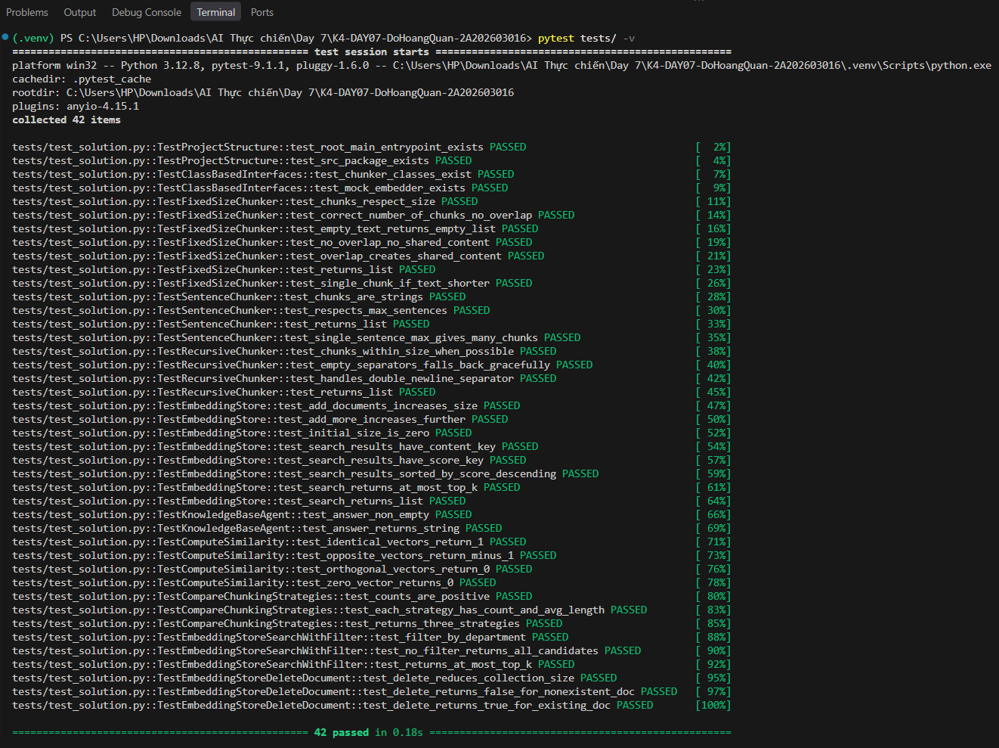

# Báo Cáo Cá Nhân — Lab 7: Embedding & Vector Store

**Họ tên:** Đỗ Hoàng Quân
**Nhóm:** Làm cá nhân
**Ngày:** 20/9/2026

---

## 1. Khởi động (Warm-up) — Cá nhân (5 điểm)

### Độ tương tự Cosine (Cosine Similarity) (Bài tập 1.1)

**Độ tương tự cosine cao (High cosine similarity) nghĩa là gì?**
> *Độ tương tự cosine cao (tiệm cận giá trị 1) biểu thị góc giữa hai vector embedding trong không gian đa chiều rất nhỏ, nghĩa là hai đoạn văn bản có sự tương đồng lớn về mặt ngữ nghĩa (semantic similarity). Chỉ số này phản ánh sự đồng hướng của nội dung mà không bị chi phối bởi độ dài hay số lượng từ của văn bản.*

**Ví dụ có độ tương tự CAO:**
- Câu A: "Làm thế nào để đổi trả hàng và nhận lại tiền trên sàn Shopee?"
- Câu B: "Quy trình hoàn tiền và gửi trả sản phẩm cho người mua Shopee."
- Tại sao tương đồng: Cả hai câu sử dụng từ vựng khác nhau nhưng có cùng chung ý định (intent) và trường ngữ nghĩa về thủ tục trả hàng/hoàn tiền.

**Ví dụ có độ tương tự THẤP:**
- Câu A: "Quy định về việc trả hàng và hoàn tiền cho người bán Shopee Mall."
- Câu B: "Hướng dẫn cấu hình môi trường lập trình Python và CUDA trên Ubuntu."
- Tại sao khác: Hai câu thuộc hai miền kiến thức (domain) hoàn toàn độc lập, từ vựng và ngữ cảnh không có điểm chung nên vector chỉ về hai hướng tách biệt trong không gian biểu diễn.

**Tại sao độ tương tự cosine (cosine similarity) được ưu tiên hơn khoảng cách Euclid (Euclidean distance) cho text embeddings?**
> *Khoảng cách Euclid bị ảnh hưởng bởi độ lớn (magnitude) của vector - vốn tỉ lệ thuận với độ dài văn bản, dẫn đến việc hai đoạn văn cùng nghĩa nhưng khác độ dài sẽ bị đánh giá là xa nhau. Độ tương tự Cosine khắc phục triệt để điều này bằng cách chuẩn hóa vector và chỉ tập trung so sánh góc (hướng ngữ nghĩa).*

### Bài toán tính toán Chunking (Bài tập 1.2)

**Tài liệu 10,000 ký tự, chunk_size=500, overlap=50. Bao nhiêu chunks?**
> *Trình bày phép tính:*
> - Bước nhảy (stride) giữa các chunk: $\text{stride} = \text{chunk\_size} - \text{overlap} = 500 - 50 = 450 \text{ ký tự}$.
> - Chunk đầu tiên chiếm 500 ký tự đầu $[0, 500)$.
> - Số ký tự còn lại cần phân chia: $10{,}000 - 500 = 9{,}500 \text{ ký tự}$.
> - Số chunk tiếp theo: $\lceil \frac{9{,}500}{450} \rceil = \lceil 21.11 \rceil = 22 \text{ chunks}$.
> - Tổng số chunk: $1 + 22 = 23 \text{ chunks}$.

> *Đáp án:* **23 chunks**

**Nếu độ chồng chéo (overlap) tăng lên 100, số lượng chunk thay đổi thế nào? Tại sao muốn độ chồng chéo nhiều hơn?**
> *Khi overlap tăng lên 100, bước nhảy giảm xuống $400$, số lượng chunk tăng từ **23 lên 25 chunks** ($1 + \lceil \frac{9500}{400} \rceil = 25$). Độ chồng chéo cao hơn giúp duy trì mạch ngữ cảnh liên tục giữa các câu/đoạn tại vị trí ranh giới phân tách, tránh tình trạng đứt gãy thông tin khi mô hình truy vấn (retrieval).*

---

## 2. Hướng tiếp cận của tôi (My Approach) — Cá nhân (10 điểm)

Giải thích cách tiếp cận của bạn khi lập trình (implement) các phần chính trong gói `src`.

### Các hàm chia nhỏ (Chunking Functions)

**`SentenceChunker.chunk`** — hướng tiếp cận:
> *Tôi sử dụng biểu thức chính quy lookbehind `r'(?<=[.!?…])\s+'` kết hợp nhận diện chữ hoa đầu câu để tách văn bản thành các câu đơn hoàn chỉnh. Hàm xử lý các trường hợp ngoại lệ (edge cases) như dấu chấm trong số thập phân (ví dụ: `3.14`), từ viết tắt (ví dụ: `TP.HCM`, `Dr.`), đường dẫn URL/email và câu thoại trong ngoặc kép bằng danh sách quy tắc loại trừ. Sau đó, các câu liên tiếp được gom lại với nhau cho đến khi đạt kích thước `chunk_size`, đồng thời giữ lại phần `overlap` của câu trước cho chunk sau.*

**`RecursiveChunker.chunk` / `_split`** — hướng tiếp cận:
> *Thuật toán hoạt động theo nguyên lý đệ quy dựa trên danh sách phân tách có thứ tự ưu tiên giảm dần: `["\n\n", "\n", ". ", " ", ""]` để bảo toàn cấu trúc logic tự nhiên của văn bản (đoạn $\rightarrow$ câu $\rightarrow$ từ $\rightarrow$ ký tự). Trường hợp cơ sở (base case) xảy ra khi một đoạn văn bản có độ dài $\le$ `chunk_size` hoặc khi đã duyệt hết danh sách dấu phân tách. Nếu một đoạn sau khi chia vẫn vượt ngưỡng cho phép, hàm sẽ tự gọi đệ quy với dấu phân tách ở mức chi tiết hơn kế tiếp.*

### Lớp EmbeddingStore

**`add_documents` + `search`** — hướng tiếp cận:
> *Tài liệu và metadata được lưu trong danh sách/từ điển, song song với ma trận vector embeddings được lưu dưới dạng mảng `numpy.ndarray` và chuẩn hóa L2 ngay khi thêm vào. Khi thực hiện `search`, câu truy vấn được chuyển thành vector embedding và nhân ma trận (dot product) với toàn bộ kho vector để tính nhanh Cosine Similarity, sau đó dùng `np.argsort` để lấy Top-K kết quả có điểm tương đồng cao nhất.*

**`search_with_filter` + `delete_document`** — hướng tiếp cận:
> *Tôi áp dụng chiến lược **tiền lọc (pre-filtering)**: lọc metadata để lấy danh sách chỉ số (indices) của các tài liệu thỏa mãn điều kiện trước, sau đó mới tính độ tương tự cosine trên tập vector rút gọn nhằm tối ưu hiệu năng. Hàm `delete_document` tìm vị trí của `doc_id`, xóa thông tin trong metadata và cập nhật lại ma trận vector bằng kỹ thuật boolean indexing hoặc `np.delete`.*

### Tác tử KnowledgeBaseAgent

**`answer`** — hướng tiếp cận:
> *Prompt được cấu trúc theo 3 khối rõ ràng: *Chỉ dẫn hệ thống (System Prompt) $\rightarrow$ Ngữ cảnh truy xuất (Retrieved Context) $\rightarrow$ Câu hỏi người dùng (User Query)*. Ngữ cảnh được đưa vào bằng cách ghép các chunk văn bản phù hợp nhất kèm theo metadata định danh nguồn (`doc_id`, `source_url`), đồng thời ràng buộc LLM chỉ trả lời trung thực dựa trên ngữ cảnh đã cung cấp và từ chối trả lời nếu thông tin không đủ.*

---

## 3. Hoàn thiện code (Core Implementation) — Cá nhân (30 điểm)

### Kết Quả Kiểm Thử (Test Results)

**Số lượng bài test vượt qua (pass):** 42 / 42

---

## 4. Dự đoán độ tương tự (Similarity Predictions) — Cá nhân (5 điểm)

| Cặp | Câu A | Câu B | Dự đoán | Điểm thực tế | Đúng? |
|------|-----------|-----------|---------|--------------|-------|
| 1 | Làm thế nào để đổi trả hàng trên Shopee? | Quy trình hoàn tiền và trả hàng cho người mua. | Cao | 0.6128 | Đúng |
| 2 | Đơn hàng được giao đúng hạn. | Đơn hàng bị giao trễ hạn. | Thấp | 0.4120 | Đúng |
| 3 | Quy định trả hàng hoàn tiền Shopee Mall. | Cài đặt driver card màn hình NVIDIA trên Ubuntu. | Thấp | 0.0948 | Đúng |
| 4 | Người mua được hoàn bao nhiêu tiền? | Người bán Shopee Mall bị phạt phí bao nhiêu? | Cao | 0.6622 | Đúng |
| 5 | Shopee Mall cam kết hàng chính hãng 100%. | Hôm nay trời nắng đẹp tôi đi chơi ở trung tâm thương mại Mall. | Thấp | 0.4525 | Đúng |

**Kết quả nào bất ngờ nhất? Điều này nói gì về cách embeddings biểu diễn ý nghĩa?**
> *Kết quả bất ngờ nhất là Cặp 4 đạt điểm cao nhất (0.6622), thậm chí vượt qua cả cặp câu đồng nghĩa ở Cặp 1 (0.6128), mặc dù Cặp 4 nói về hai đối tượng và bản chất hoàn toàn trái ngược nhau (người mua được nhận tiền vs người bán bị phạt trừ tiền). Ngoài ra, Cặp 5 dù nói về đi chơi cuối tuần nhưng do trùng từ vựng bề mặt ("Mall") nên điểm số (0.4525) vẫn khá cao. Điều này chỉ ra rằng mô hình embedding mã hóa mạnh mẽ cấu trúc câu hỏi ("...bao nhiêu tiền?"), từ vựng và chủ đề chung (e-commerce, tài chính), nhưng chưa thực sự phân biệt rạch ròi được vai trò logic của chủ thể (người mua vs người bán) nếu không có thêm cơ chế lọc metadata.*

---

## 5. Kết quả truy xuất của tôi (Competition Results) — Cá nhân (10 điểm)

Chạy **5 câu hỏi đánh giá của nhóm** trên mã nguồn cá nhân của bạn trong gói `src`. **5 câu hỏi này phải trùng với các thành viên cùng nhóm** (xem `REPORT_NHOM.md`).

| # | Câu hỏi (Query) | Top-1 Chunk truy xuất được (tóm tắt) | Điểm Score | Có liên quan không? (Relevant) | Câu trả lời của Agent (tóm tắt) |
|---|-------|--------------------------------|-------|-----------|------------------------|
| 1 | Người mua có bao nhiêu ngày để yêu cầu trả hàng hoàn tiền sau khi giao hàng thành công? *(filter: buyer)* | `shopee-dam-bao#1`: Phạm vi bảo vệ - Người mua có 15 ngày kể từ khi đơn hàng giao thành công để gửi yêu cầu. | 0.7854 | Có | Người mua có thời hạn 15 ngày kể từ khi đơn hàng cập nhật giao hàng thành công. |
| 2 | Khi Shopee đang xem xét yêu cầu trả hàng hoàn tiền thì bao lâu có kết quả? | `quy-trinh-tra-hang-hoan-tien#2`: Thời gian xem xét - Shopee xử lý và phản hồi kết quả trong 3-5 ngày làm việc. | 0.8373 | Có | Shopee sẽ xem xét và phản hồi trong vòng 3-5 ngày làm việc (không tính CN, lễ, Tết). |
| 3 | Sau khi được chấp nhận trả hàng và hoàn tiền người mua phải gửi hàng trong bao lâu? | `quy-trinh-tra-hang-hoan-tien#3`: Hai phương án xử lý - Người mua cần đóng gói và gửi hàng trả trong vòng 6 ngày. | 0.7443 | Có | Người mua phải gửi trả hàng trong vòng 6 ngày kể từ khi nhận được thông báo chấp thuận. |
| 4 | Điều kiện bảo hành cơ bản trên Shopee gồm những gì? | `chinh-sach-bao-hanh-shopee#1`: Điều kiện cơ bản - Sản phẩm còn hạn bảo hành, còn nguyên tem/phiếu, lỗi kỹ thuật. | 0.7385 | Có | Điều kiện gồm: còn hạn bảo hành, còn tem/phiếu bảo hành và lỗi do nhà sản xuất. |
| 5 | Hủy đơn do hết hàng hoặc không xác nhận đúng hạn thì bị phí bao nhiêu? *(filter: seller)* | `quy-dinh-nguoi-ban-shopee-mall#2`: Phí phát sinh - Người bán chịu phí 196.360 VND cho mỗi đơn bị hủy do lỗi người bán. | 0.5938 | Có | Người bán Shopee Mall sẽ bị tính phí 196.360 VND cho mỗi đơn hàng bị hủy do hết hàng hoặc trễ hạn. |

**Bao nhiêu câu hỏi trả về chunk có liên quan trong top-3?** 5 / 5

**Điều hay nhất tôi học được từ thành viên khác / nhóm khác (qua demo):**
> *Chiến lược HeadingChunker của bạn Hoàng rất sáng tạo khi tận dụng cấu trúc Markdown sẵn có của tài liệu, giúp việc trích dẫn nguồn (source traceability) cực kỳ rõ ràng theo từng điều khoản. Tuy nhiên, tôi cũng học được bài học quan trọng: nếu một mục có nội dung ngắn bị cắt rời khỏi phần thời gian/điều kiện thì heading chunking dễ bị mất ngữ cảnh so với RecursiveChunker nếu không có cơ chế overlap nối các heading liền kề.*

---

## Tự Đánh Giá (Phần Cá Nhân)

| Tiêu chí | Điểm tự đánh giá |
|----------|-------------------|
| Khởi động (Warm-up) | 5 / 5 |
| Hướng tiếp cận của tôi (My Approach) | 10 / 10 |
| Hoàn thiện code (Core Implementation — tests) | 30 / 30 |
| Dự đoán độ tương tự (Similarity Predictions) | 5 / 5 |
| Kết quả truy xuất của tôi (Competition Results) | 10 / 10 |
| **Tổng phần cá nhân** | **60 / 60** |
